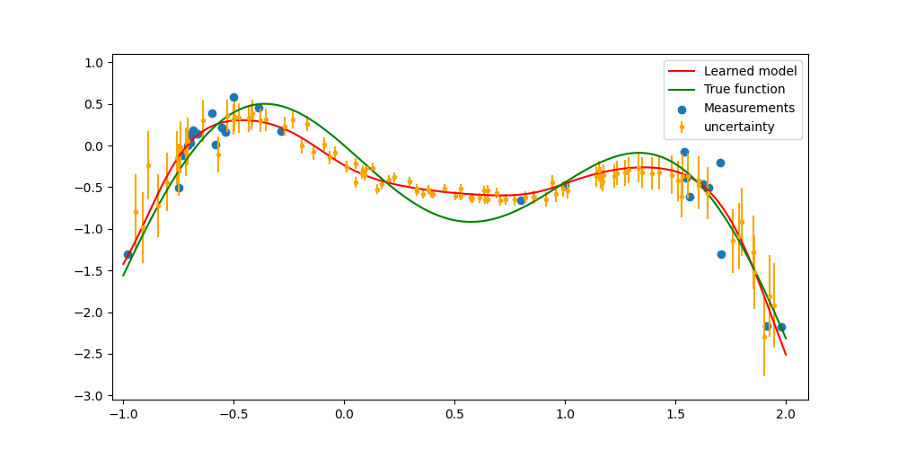

# DeepTune

[](figures/DeepTune_demo.mp4)  
A demonstration of how DeepTune learns from and optimizes an unknown system. The figure you provided illustrates the results of the DeepTune algorithm, which is designed to learn and optimize systems using machine learning:  
  
- **Learned Model (Red Line)**: This line represents the model that has been fitted by the DeepTune algorithm to the data.  
- **True Function (Green Line)**: This line depicts the actual underlying function (or system) that the model is trying to approximate.  
- **Measurements (Blue Dots)**: These are the data points collected, showing the measurements used for training the model.  
- **Uncertainty (Orange Bars)**: These vertical lines indicate the uncertainty in the measurements, providing a visual representation of prediction uncertainty.   

## Overview

This directory contains the code and data necessary to reproduce the plots presented in the paper "WayFinder: Automated Operating System Specialization," which relates to DeepTune.
It provides Python scripts, precomputed DeepTune permutations, and simulations of random baselines to reproduce the experimental results from the paper.

> [!IMPORTANT]
> Due to internal policies of NEC Laboratories Europe, we are unable to share the DeepTune implementation.

## Project Structure

```ascii
.
├── measurements/          # Permutation measurements done with WayFinder
└── plotting/              # Plot generation for each experiment
    └── [plot-name]/       # One folder per plot
        ├── data/          # Relevant data for the experiment
        ├── scripts/       # Python plotting code
        └── pdfs/          # Generated PDF plots
```

### Directory Details

- **measurements/**: Contains the permutation measurements obtained using WayFinder
- **plotting/**: Contains subdirectories for each plot presented in the paper
  - **data/**: Experimental data required for generating the plot
  - **scripts/**: Python scripts for plot generation
  - **pdfs/**: Output directory for generated PDF plots

## Environment Setup

1. Create a virtual environment:

```bash
python -m venv venv
```

1. Activate the virtual environment:

```bash
# On macOS/Linux
source venv/bin/activate

# On Windows
venv\Scripts\activate
```

1. Install dependencies:

```bash
pip install -r requirements.txt
```

## Reproducing the Plots

Navigate to the desired plot folder under `plotting/[plot-name]/scripts/` and run the Python plotting scripts. The generated PDFs will be saved in the corresponding `pdfs/` folder.

```bash
cd plotting/[plot-name]/scripts/
python task_similarity_plot.py
```

```console
Similarity matrix plot saved to: ../pdfs/new_transfer_learning_mat.pdf
```

> [!NOTE]
> Due to minor variations in the random methods employed, there may be slight discrepancies between the plots in the paper and the results generated using the code in this repository.
